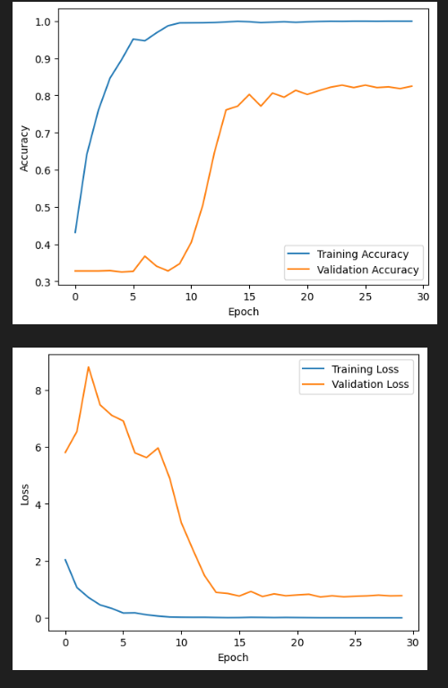

# Vehicle Damage Insurance Verification

Developed a deep learning project using Convolutional Neural Networks (CNN) to classify vehicle damage image for insurance verification.

## Tools and Technologies

*   Python
*   Pandas
*   Numpy
*   Scikit-Learn
*   TensorFlow

## Results

The result of the improvement model are also still overfit but `Train` and `Validation` increase so that it is better than the baseline model even though the model can arguqbly only remember, with a Train 1 and Validation 0.82. But the `Loss` in this improvement model is good because the results of the line move in the right direction, it shows that the model learns properly

## Conclusion

- From EDA we can conclude that the dataset is very unbalance, it makes the model can't learn properly. From the baseline model and the model Improvement we can see that there are improvements between the baseline model and the improvement model, althought the result is still overfit. It causes the results of the classification prediction only correct 2 out if 5 on the prediction test.

- Therefore, for further improvement can create more balanced dataset, and also can add an image augmentation and look for better model parameters in order to get the best result of the model so the model can be used in the real case scenarios.